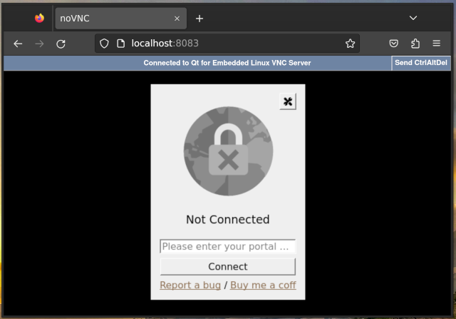
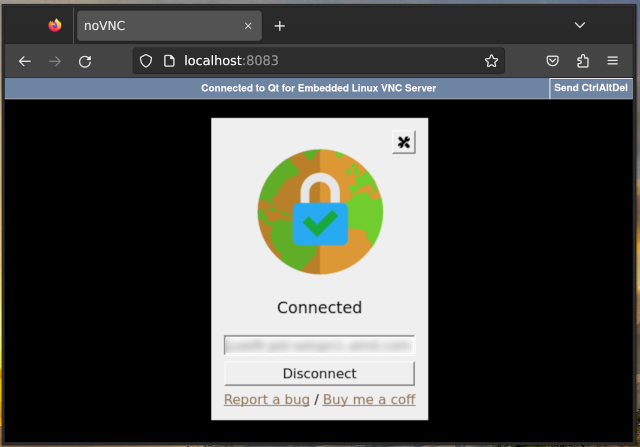
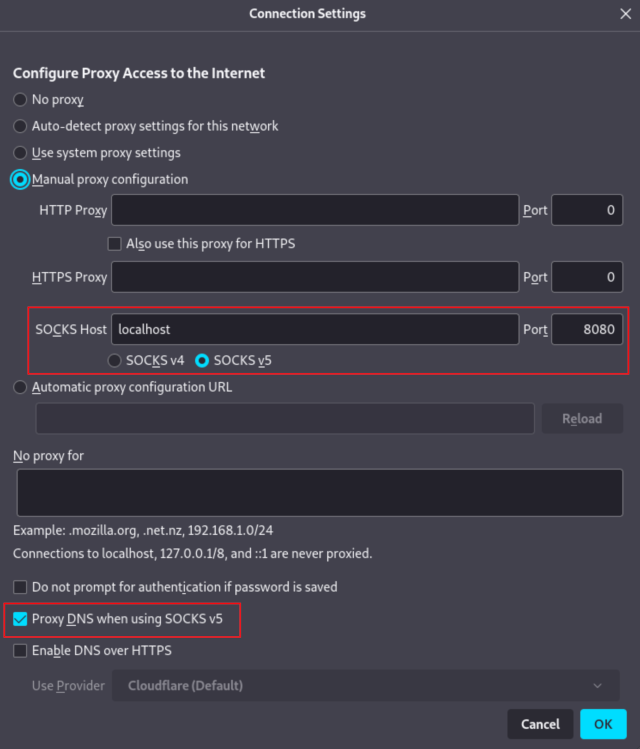

# GlobalProtect VPN client (GUI) in a Docker container

This is an implementation of GlobalProtect VPN client (GUI), which runs in a Docker container and exposes the VPN connection to the users as a SOCKS5 proxy.

Technically, the Docker container runs a fork of [GlobalProtect-openconnect](https://github.com/yuezk/GlobalProtect-openconnect), redesigned to come as a single executable, without client-server separation.



## Features

- Similar user experience as the official client in macOS.
- Supports both SAML and non-SAML authentication modes.
- Supports automatically selecting the preferred gateway from the multiple gateways.
- Supports switching gateway from the system tray menu manually.
- Memorizes credentials and authenticates automatically without a dialog.

# Docker
 
```
git clone --recurse-submodules https://github.com/dmikushin/globalprotect-docker.git
cd globalprotect-docker
docker build -t gpagent-docker -f docker/Dockerfile .
docker-compose up -d
```
 
On the first run, navigate to `http://localhost:8083` in the web browser to provide authentication credentials. On subsequent invocations, the container will  try to use the cached credentials.

When the connection is established, configure your applications to use the provided SOCKS5 proxy. For example, Firefox:



## Manual Installation

Prerequisites:

```
sudo apt-get install -y \
     build-essential \
     qtbase5-dev \
     libqt5websockets5-dev \
     qtwebengine5-dev \
     qttools5-dev \
     qt5keychain-dev \
     openconnect
```

Building:

```
git clone --recurse-submodules https://github.com/dmikushin/globalprotect-docker.git
cd globalprotect-docker
mkdir build
cd build
cmake -G Ninja ..
cmake --build .
sudo cmake --install .
```

Without client-server separation, we binary must be executed with elevated priviledges:

```
sudo ./gpagent
```

## Troubleshooting

Run `docker-compose logs` in the Terminal and collect the logs.

